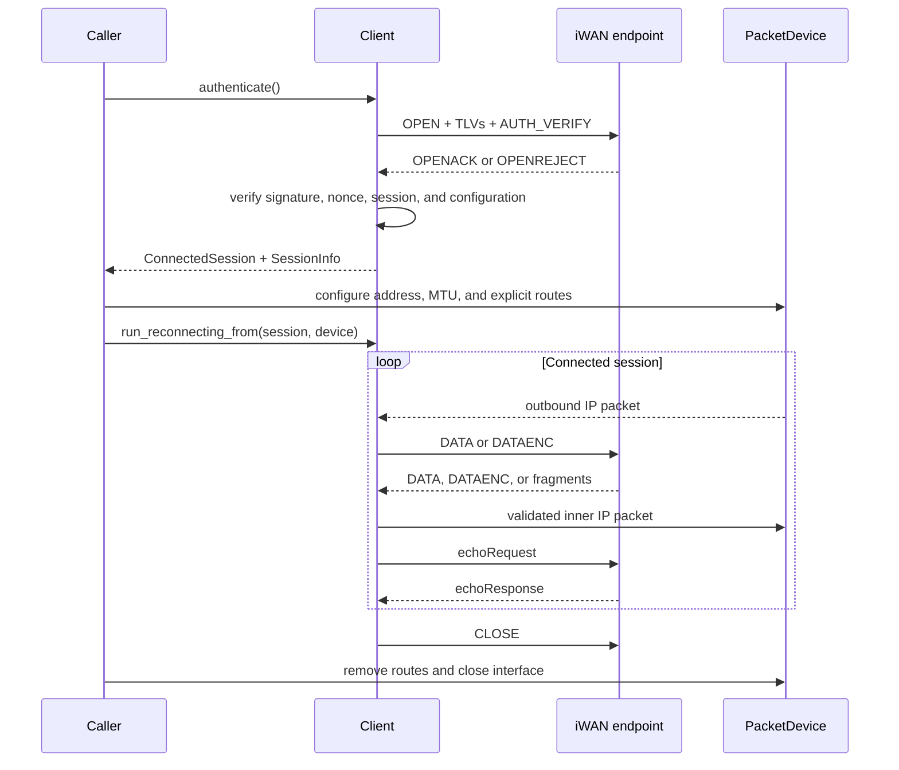
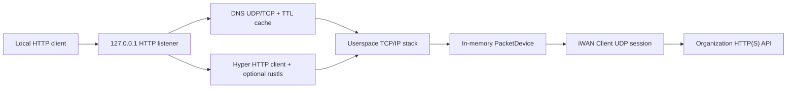

# Architecture

OpeniWAN separates wire compatibility, session state, and host networking so
that protocol code can be tested without privileged access to a TUN device.

## Scope

The data-plane compatibility target is the traditional single-path UDP protocol
observed in macOS iWAN client `2.3.0 (230)`. The optional managed layer supports
configuration-driven OIDC providers and the compatible Panabit mobile
controller flow. It does not claim compatibility with controllers that use a
different signing, response, or password-wrapping scheme. General operating
system DNS/policy management and SEGRT/SR multipath remain outside the
boundary; the route-free HTTP proxy includes its own bounded DNS client.

## Crate Layout

| Module | Responsibility |
|---|---|
| `protocol` | Packet headers, packet types, TLVs, signatures, and control-packet builders |
| `crypto` | Legacy password wrapping and data-plane compatibility ciphers |
| `client` | Authentication, session validation, heartbeat, packet exchange, and reconnection |
| `fragment` | Strict fragment parsing, bounded reassembly, and inner IP validation |
| `config` | Serializable client and reconnect configuration |
| `managed` | Provider validation, OIDC/JWKS, controller signing, encrypted line state |
| `tun` | Cross-platform TUN, Wintun deployment, interface configuration, routes, and cleanup |
| `error` | Public error model |
| `bin/openiwan` | CLI, secret input, signals, userspace HTTP proxy, logging, and command dispatch |

The `PacketDevice` trait is the boundary between protocol/session logic and a
TUN interface or userspace IP stack.

## Managed Provider Lifecycle

The default-enabled `managed` feature keeps organization parameters outside the
binary in a protected provider TOML file. A managed fetch:

1. loads and validates the provider and its file permissions
2. performs OIDC discovery and creates a PKCE S256 request with state and nonce
3. validates the callback, exchanges the code, and verifies the ID token through
   the advertised JWKS
4. signs the exact controller request bytes and calls auth, keepalive, and config
5. atomically stores only the encrypted line records

At connect time, only the selected line password is authenticated and decrypted.
It is passed directly into the normal `Client` lifecycle and zeroized on drop.
OAuth tokens and plaintext line passwords are never persisted.

## Session Lifecycle

## Authentication

`Client::authenticate` resolves one UDP endpoint, creates a connected UDP
socket, builds OPEN, and retries within the configured authentication budget.
Every response passes through the strict control-packet decoder before the
client accepts OPENACK.

OPENACK validation includes:

- a valid control signature
- a nonzero session ID
- a matching AUTH_VERIFY nonce when present, with provider-controlled handling
  for deployments known to omit the echo
- consistency between requested, header, and advertised encryption
- bounded MTU and correctly sized address attributes

Credentials are owned by `Client`, redacted from `Debug`, and zeroized on drop.
Session cipher keys are also zeroized on drop.

## Data Plane

The session uses:

- one receive loop for UDP datagrams
- one worker for packets read from `PacketDevice`
- one heartbeat worker

The UDP socket is connected to the selected endpoint. Stateful packets must
match the active session ID and token. Malformed or unrelated datagrams are
dropped; device and socket failures terminate the session.

IPv4 and IPv6 fragments use separate bounded reassembly queues. Reassembled or
decrypted packets are checked against their inner IP length before delivery.

## Reconnection

Transient transport and heartbeat failures use bounded exponential backoff.
The native TUN path compares the address, gateway, netmask, and MTU from every
new OPENACK with the original assignment. It stops if the assignment changes,
rather than continuing with stale host configuration.

A session that remains healthy for at least one heartbeat timeout resets the
consecutive-failure budget.

## Host Networking

`TunDevice` wraps `tun` 0.8.14. Linux and macOS use the crate's nonblocking
device; Windows splits its asynchronous Wintun reader and writer behind a
dedicated Tokio runtime. Windows reads have a 100 ms polling timeout so the
existing synchronous `PacketDevice` contract can stop and reconnect promptly.

The authenticated address, mask, and MTU are applied as part of interface
creation. macOS automatically allocates `utunN` unless an explicit valid name
is requested. The legacy Unix address ioctls used upstream are IPv4-specific,
so OpeniWAN applies IPv6 `/128` addresses with `ip` on Linux or `ifconfig` on
macOS after creating the device through `tun`; MTU, state, framing, and device
lifetime remain owned by `tun`.

Linux and macOS routes continue to use their system route tools. Windows routes
use the IP Helper API and the Wintun interface LUID, with no localized command
output parsing. Route installation is transactional: partial changes are
reversed, replaced rows are restored, and only rows owned by the guard are
removed at shutdown.

The official x86_64 and ARM64 Wintun 0.14.1 DLLs are embedded per target
architecture. First use verifies the embedded SHA-256, atomically extracts the
DLL to versioned LocalAppData storage, and loads it by absolute path with
Authenticode verification enabled.

CIDR, IP, and one-time domain targets share one resolver. It rejects invalid
targets, default routes, duplicates, and routes that would contain the active
iWAN endpoint before changing the host network.

Default routes are intentionally rejected. A future full-tunnel implementation
must first pin the control endpoint to the physical uplink and provide
platform-specific route restoration.

## Route-free HTTP proxy

The default-enabled `http-proxy` feature adds a second `PacketDevice`
implementation backed by bounded in-memory channels. A `tokio-smoltcp`
IP-medium interface consumes the address, netmask, gateway, and MTU from
`SessionInfo` and exposes asynchronous TCP streams. These routes exist only in
that userspace stack.

The local listener accepts HTTP/1.1 only on a loopback address. Hyper preserves
streaming request and response bodies while a fixed-destination connector
resolves the configured host through an organization DNS server inside iWAN,
filters addresses to the iWAN session family, opens TCP through the userspace
stack, and, for HTTPS, performs rustls certificate and SNI validation. HTTP
upstreams use the same userspace TCP path without TLS. The connector never
falls back to a host TCP socket.

DNS transaction IDs, response headers, questions, address families, and bounded
CNAME chains are validated. Answers are cached using bounded TTLs. UDP
truncation triggers a query to the same resolver over userspace TCP. Resolver
selection prefers CLI/provider/OPENACK servers inside iWAN. `auto` uses host DNS
only when no iWAN resolver exists; failure of a configured iWAN resolver is
fail-closed. Host `198.18.0.0/15` Fake-IP answers are rejected. `iwan` requires
an iWAN resolver, while `system` explicitly selects host DNS. `--upstream-ip`
remains an emergency override without changing HTTP Host or, for HTTPS, TLS
SNI and certificate verification.

Only the outer iWAN UDP socket uses existing host networking. The route-free
guarantee means this path never creates an interface or adds, replaces, or
removes an operating-system route.

## Trust Boundaries

The project assumes that:

- callers provide authorized endpoint and credential data
- `PacketDevice` implementations use nonblocking reads
- system networking tools, Windows IP Helper, and the verified Wintun binary
  are trusted platform components

The project does not assume that UDP bodies are well formed. All lengths,
types, session fields, fragments, and inner IP packets are validated before
use.

Legacy iWAN cryptography does not authenticate data packets. Defensive parsing
limits implementation risk but cannot add security properties absent from the
wire protocol.

## Extending the Protocol

Protocol changes should begin with a synthetic test and documented evidence.
Keep unverified behavior behind an explicit compatibility boundary. SEGRT
support, in particular, requires authorized bidirectional interoperability data
and must not be inferred solely from type names or isolated constants.
